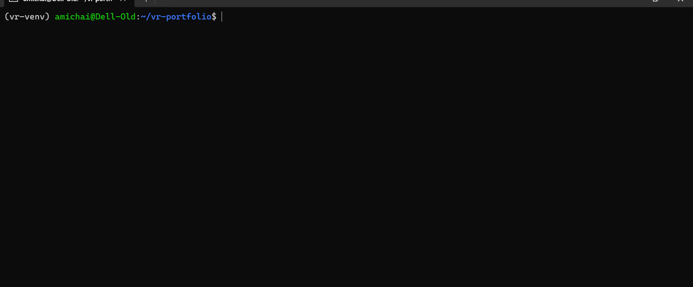

# Vulnerability Research Lab Setup

This document details the isolated virtual machine (VM) environment established for research purposes, and the complete toolchain installation process on Ubuntu, in case a setup from scratch is required.

## Core Principle: Isolation (Why a VM?)
The primary principle of this lab is isolation. Researching vulnerabilities requires a safe environment to execute potentially malicious code (malware), run vulnerable containers, and test exploits without risking the host personal computer. The VM ensures that any damage or compromise is contained.

## Environment and Installed Versions
* **Operating System:** Ubuntu 24.04 LTS (Isolated VM)
* **Compiler:** gcc (Ubuntu 13.3.0-6ubuntu2~24.04.1) 13.3.0
* **Debugger:** GNU gdb (Ubuntu 15.1-1ubuntu1~24.04.1) 15.1 (with pwndbg plugin)
* **Python & Exploit Dev:** Python 3.12.3 (with pwntools installed in a virtualenv)
* **Containerization:** Docker version 29.1.3, build 29.1.3-0ubuntu3~24.04.2
* **Reverse Engineering:** Ghidra (Manual Installation)

---

## Lab Snapshots and Rollback Policy
An experienced researcher always maintains a clean state. A baseline snapshot was taken after installing all the tools above. 

**When and why to revert to this snapshot:**
1. **Post-Malware Analysis:** After detonating or analyzing untrusted code to ensure no persistent infections remain.
2. **System Corruption:** If experimental tools, kernel modifications, or broken dependencies corrupt the environment.
3. **Clean Slate for New Projects:** Before starting a new major CTF or research project to guarantee a pristine, predictable environment.
4. **Storage Management:** If the system gets cluttered with old vulnerable docker containers, compiled binaries, and artifacts.

---
## Installation and Recovery Guide

# Base tools: Compiler, debugger, git, python, docker
sudo apt update
sudo apt install -y build-essential gdb git python3 python3-pip python3-venv docker.io docker-compose-plugin

# pwndbg: An enhancement layer over gdb, integrating well with pwntools
git clone [https://github.com/pwndbg/pwndbg](https://github.com/pwndbg/pwndbg)
cd pwndbg && ./setup.sh && cd ..

# pwntools inside a dedicated virtualenv
python3 -m venv ~/vr-venv
source ~/vr-venv/bin/activate
pip install pwntools

Note: You must run source ~/vr-venv/bin/activate every time you open a new terminal. Alternatively, you can add this line to your ~/.bashrc file for automatic activation.

# Add user to the docker group to avoid using sudo every time
sudo usermod -aG docker $USER
# You need to log out and log back in (or restart the VM) for this change to take effect

# Ghidra (Manual Installation for Ubuntu)
* Install JDK 25 64-bit

* Download a Ghidra release file from here: https://github.com/NationalSecurityAgency/ghidra/releases

* Extract the Ghidra release file

* Launch by running: ./ghidraRun

## Usernames
# picoCTF: AmicaiMukades
# pwn.college: AmicaiMukades
# PortSwigger: AmicaiMukades