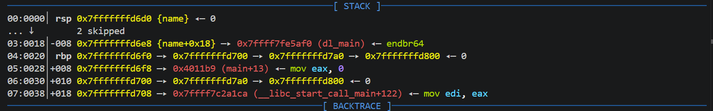
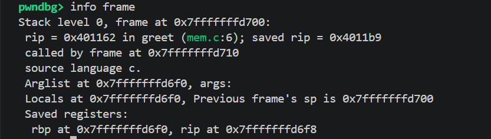
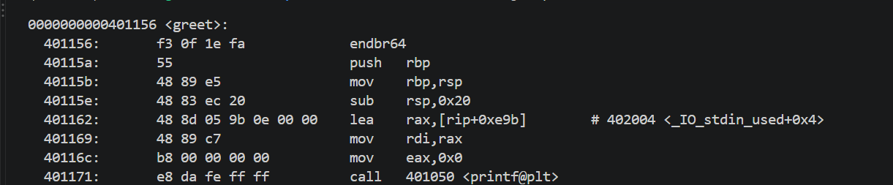
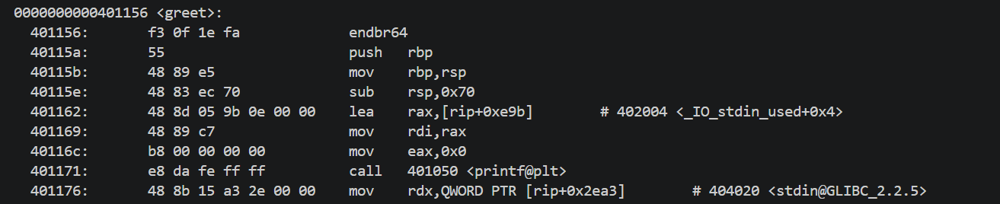
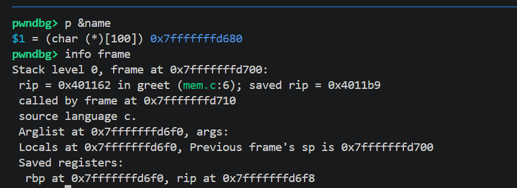
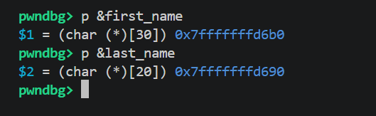

## Exercise 1: stack frame map of greet() (original 32-byte buffer)

build with debug symbol and stable addresses to learn:
 gcc -g -O0 -no-pie -fno-stack-protector -o mem mem.c

From objdump (static disassembly):

    40115a: 55                push   rbp
    40115b: 48 89 e5          mov    rbp,rsp
    40115e: 48 83 ec 20       sub    rsp,0x20      ; allocate 32 bytes for name
    40117d: 48 8d 45 e0       lea    rax,[rbp-0x20] ; &name = rbp - 0x20

Confirmed at runtime with gdb (breakpoint at greet, before fgets):

    p &name        -> 0x7fffffffd6d0
    info frame     -> rbp at 0x7fffffffd6f0, rip (return address) at 0x7fffffffd6f8, saved rip = 0x4011b9

Stack frame map:

    address              contents
    -------              --------
    0x7fffffffd6d0        name[32]        (buffer, 32 bytes)
    0x7fffffffd6f0        saved rbp       (= 0x7fffffffd700, caller's rbp)
    0x7fffffffd6f8        return address  (= 0x4011b9, main+13)

Distance from &name to the return address:
    0x7fffffffd6f8 - 0x7fffffffd6d0 = 0x28 = 40 bytes
    (32 bytes of buffer + 8 bytes of saved rbp)

Conclusion: a buffer overflow of more than 32 bytes starts overwriting
the saved rbp, and at 40+ bytes it overwrites the return address —
the value the CPU jumps to on `ret`.

## Exercise 2: buffer size change (32 → 100 bytes)

gcc -g -O0 -no-pie -fno-stack-protector -o mem_100 mem_100.c

After changing `char name[32]` to `char name[100]` and recompiling,
objdump shows:

    40115e: 48 83 ec 70    sub    rsp,0x70

`0x70` = 112 bytes, not 100. This is due to x86-64 stack alignment:
rsp must be a multiple of 16 at the point of a `call` instruction.
After `push rbp` in the prologue, rsp is offset by 8 bytes from full
alignment, so the compiler rounds the requested 100 bytes up to the
next value that restores 16-byte alignment — 112 bytes. The extra
12 bytes are alignment padding, not part of `name` itself.

Confirmed at runtime with gdb:

    p &name        -> 0x7fffffffd680
    info frame     -> rbp at 0x7fffffffd6f0, rip at 0x7fffffffd6f8

Distance from &name to saved rbp:
    0x7fffffffd6f0 - 0x7fffffffd680 = 0x70 = 112 bytes

Distance from &name to the return address:
    0x7fffffffd6f8 - 0x7fffffffd680 = 0x78 = 120 bytes
    (112 bytes of allocated stack space + 8 bytes of saved rbp)

Conclusion: the 100-byte request became a 112-byte allocation due to
16-byte stack alignment, matching the `sub rsp,0x70` seen in objdump.

## Exercise 3: two buffers, allocation order

gcc -g -O0 -no-pie -fno-stack-protector -o mem_two_buf mem_two_buf.c

Code:
    char first_name[30];  // declared first
    char last_name[20];   // declared second

objdump shows:
    sub rsp, 0x40         ; 64 bytes allocated total

Runtime addresses (gdb):
    rbp          = 0x7fffffffd6d0
    &first_name  = 0x7fffffffd6b0   (rbp - 0x20)
    &last_name   = 0x7fffffffd690   (rbp - 0x40)

Layout, high to low address:
    0x7fffffffd6d0   rbp (start of frame)
    0x7fffffffd6b0   first_name[30]   <- declared FIRST, 32-byte slot
    0x7fffffffd690   last_name[20]    <- declared SECOND, 32-byte slot

Findings:
1. Each variable is placed in its own 32-byte slot, even though
   first_name only needs 30 bytes and last_name only needs 20. Each
   slot is individually rounded up to a multiple of 16 - not just
   the total frame size. Total: 32 + 32 = 64 bytes, matching
   `sub rsp, 0x40`.
2. first_name, declared first, sits at the HIGHER address (closer to
   rbp, offset -0x20). last_name, declared second, sits at the LOWER
   address (offset -0x40, closer to rsp).

Conclusion: in this case, the compiler placed each local in its own
16-byte-aligned slot and kept them in declaration order (first
declared = higher address = closer to rbp). This is a compiler
choice, not a language guarantee - GCC could reorder or pack locals
differently, especially with optimizations enabled (-O0 here likely
keeps things simple and close to declaration order).

 

## Exercise 4: long input behavior

Test: fed 35 characters into the mem program (buffer declared char[32], 
fgets(name, sizeof(name), stdin)).

Observed: only 31 characters were written to `name` (fgets reserves 
1 byte for the null terminator, sizeof(name)-1). The remaining
characters stayed in stdin's input buffer - they were not written
to memory adjacent to `name`. No corruption occurred.

Why: fgets is bound by sizeof(name), the size declared in the C
source (32), NOT the actual 32-byte-aligned stack slot allocated
by the compiler. Even the alignment padding bytes (when they exist,
e.g. in the 100-byte or two-buffer versions) are unreachable via
fgets, because sizeof() only knows about the declared array size -
it has no awareness of compiler-level stack layout decisions.

What WOULD happen with an unbounded write (conceptual, not
demonstrated here):
If gets(name) were used instead (no length limit), or if fgets were
called with an incorrect/larger size argument, writing beyond 32
bytes would first overwrite the alignment padding (harmless), then
continue into saved rbp (corrupting the caller's frame pointer),
and beyond that into the return address at rbp+8 (40 bytes from
&name, per Exercise 1's layout). Overwriting the return address lets
an attacker control where the CPU jumps to when `greet` executes
`ret` - the basis of a classic stack buffer overflow exploit.

Why fgets is safer than gets:
gets() has no length parameter at all - it keeps reading and writing
until it hits a newline or EOF, with zero regard for the buffer's
actual size. fgets() requires an explicit size argument and stops
writing once that many bytes (minus 1, for the null terminator) have
been read, regardless of how much more input is waiting. This is
exactly why gets() was deprecated and removed from the C standard
library (C11) - it made buffer overflows nearly unavoidable for any
attacker-controlled input.

## Exercise 5: transcript file

Full gdb session (breakpoint, run, next, p &name, info frame,
   x/6gx $rbp, continue) captured via `set logging file` /
   `set logging enabled on` on the original mem binary (32-byte
   buffer). See: 01-foundations/gdb-session.txt