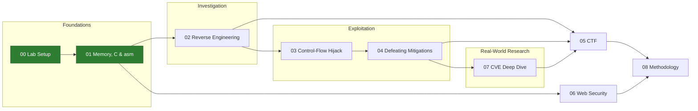

# Vulnerability Research Portfolio

A self-directed research track in vulnerability research and offensive security, from how a program looks in memory, through reverse engineering and exploitation, to a full analysis of a real-world CVE.

Every stage lives in its own folder and is considered done only when that folder is complete and documented: source code, debugger sessions, and a technical write-up explaining what was tested, what was observed, and why.

All work is done in an isolated lab VM, against my own code, intentionally vulnerable targets, and legal training platforms.

## Progress

| # | Stage | Focus | Status |
|:-:|-------|-------|:------:|
| 00 | [Lab Setup](./00-lab-setup/) | Isolated Ubuntu VM, toolchain, snapshot & rollback policy | Done |
| 01 | [Foundations](./01-foundations/) | x86-64 memory layout, stack frames, C & assembly | Done |
| 02 | Reverse Engineering | Reading binaries without source (Ghidra, objdump) | Next |
| 03 | Binary Exploitation I | Stack overflow and control-flow hijack (ret2win) | Planned |
| 04 | Binary Exploitation II | Defeating mitigations: NX, ASLR, canaries (ret2libc) | Planned |
| 05 | CTF | picoGym, pwn.college | Planned |
| 06 | Web Security | PortSwigger Web Security Academy, vulnerability report | Planned |
| 07 | CVE Deep Dive | CVE-2021-41773 (Apache path traversal) + one more | Planned |
| 08 | Methodology | Research journal, lessons learned | Planned |

## Roadmap



**The logic:** first understand how software is laid out in memory (01), then read binaries without source (02), then take control of a vulnerable program (03) and learn to bypass modern defenses (04). CTFs (05) and web security (06) sharpen and widen the attack surface. Finally, everything is applied to a real vulnerability and documented at a researcher's level (07).

## Completed so far

### 00: Lab Setup
- Isolated Ubuntu 24.04 VM, so untrusted code and vulnerable containers never touch the host
- Toolchain: gcc, gdb + pwndbg, Python + pwntools (virtualenv), Docker, Ghidra
- Clean baseline snapshot with a documented rollback policy, and a reproducible from-scratch install guide

See [setup.md](./00-lab-setup/setup.md)

### 01: Foundations (memory layout)
Five exercises, each verified both statically (`objdump`) and at runtime (`gdb`):

1. **Stack frame map:** located the buffer, saved `rbp` and return address; measured a **40-byte** offset from a 32-byte buffer to the return address
2. **Stack alignment:** a 100-byte buffer produces `sub rsp, 0x70` (112 bytes) because of 16-byte alignment
3. **Local variable ordering:** how GCC places two buffers in separate aligned slots, and why that is a compiler choice, not a language guarantee
4. **Bounded vs. unbounded input:** why `fgets` stopped the overflow, and what `gets` would have overwritten (padding, then saved `rbp`, then the return address)
5. **Full gdb transcript** of the session

See [notes.md](./01-foundations/notes.md) and [gdb-session.txt](./01-foundations/gdb-session.txt)

## Lab environment

| | |
|---|---|
| OS | Ubuntu 24.04 LTS (isolated VM) |
| Compiler | gcc 13.3 |
| Debugger | gdb 15.1 + pwndbg |
| Exploit dev | Python 3.12 + pwntools |
| Containers | Docker 29 |
| Reverse engineering | Ghidra |

## Repository structure

Folders are added as each stage is completed.

```
vr-portfolio/
  00-lab-setup/                     (done)
  01-foundations/                   (done)
  02-reverse-engineering/           crackme.c, writeup.md
  03-binexp-control-flow/ret2win/   vuln.c, exploit.py, writeup.md
  04-binexp-defeating-mitigations/  ret2libc/ vuln.c, exploit.py, writeup.md
  05-ctf/                           picogym/, pwncollege/, writeups.md
  06-web/                           portswigger-notes.md, vulnerability-report.md
  07-cve-analysis/                  CVE-2021-41773/, second CVE
  08-methodology/                   research-journal.md
```

## Training platforms

Username on picoCTF, pwn.college and PortSwigger: `AmicaiMukades`

---

*Amichai Mukades, Computer Science student (JCT), Unit 8200 veteran.*
